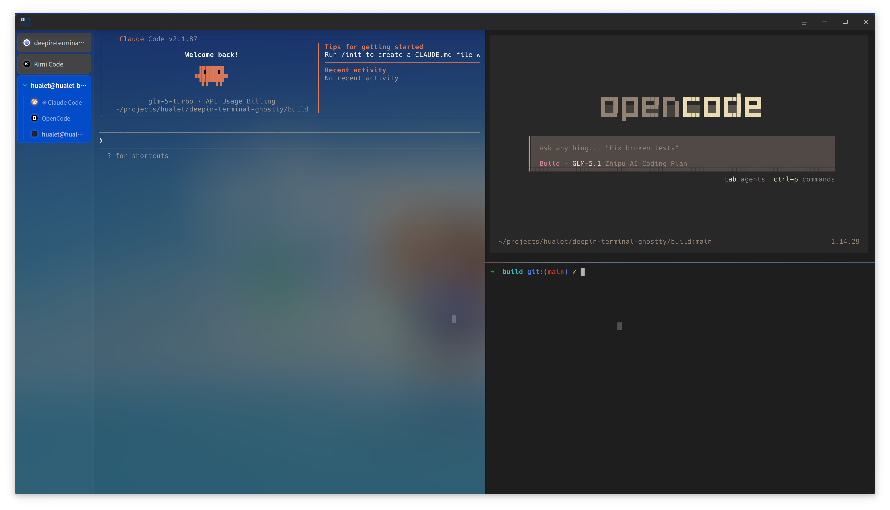
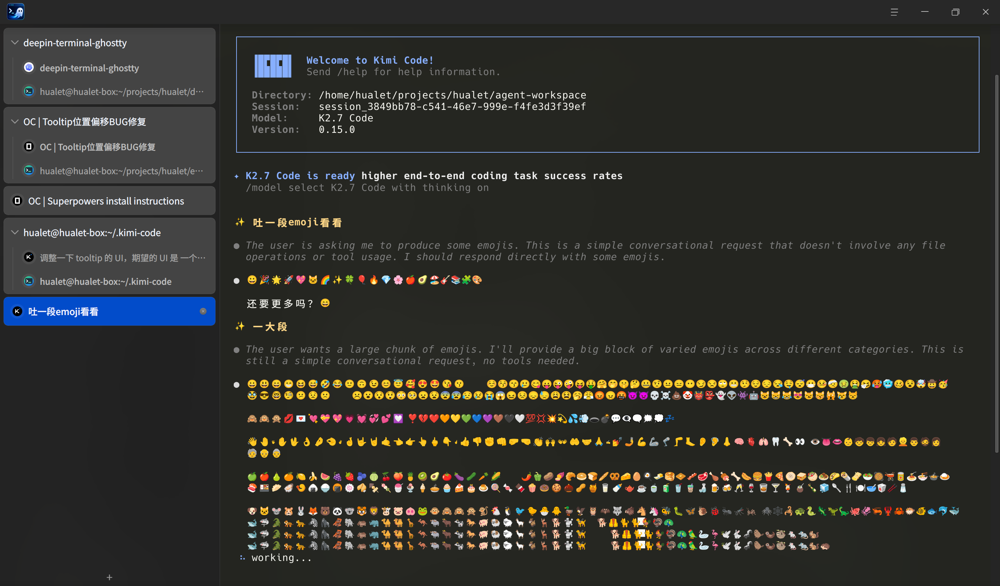
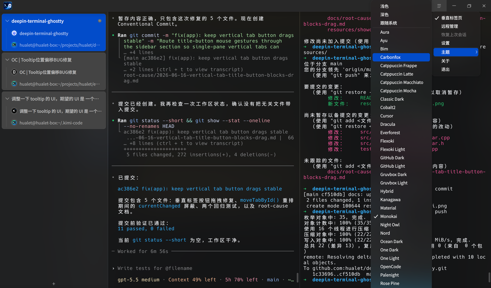

# deepin-terminal-ghostty

`deepin-terminal-ghostty` is the next-generation Deepin terminal emulator, rewritten on top of `libghostty-vt`.

It keeps the Deepin desktop integration and DTK-native experience of `deepin-terminal`, while replacing the terminal core with Ghostty's VT engine to build a faster, cleaner, and more modern foundation for future terminal features.

Vertical Tabs:


Emoji Support:


Builtin Themes:


## Overview

This project is a Linux terminal emulator built with:

- C++20
- Qt6 Widgets
- DTK6
- `libghostty-vt`

The repository currently produces:

- `qtghostty`: a reusable Qt wrapper around `libghostty-vt`
- `deepin-terminal-ghostty`: the desktop terminal application built on top of that library

## Why This Project

`deepin-terminal-ghostty` is intended to become the successor to `deepin-terminal`.

The rewrite focuses on three goals:

- modernize the terminal core with Ghostty's VT implementation
- preserve a native Deepin desktop experience instead of a generic cross-platform shell UI
- create a cleaner architecture that can support tabs, splits, settings, remote workflows, and future rendering improvements

## Current Highlights

The current development branch already includes:

- session save and restore — preserves tabs, split layouts, working directories, and terminal content (including colors) across restarts
- split panes inside a tab
- tabbed terminal workflow with horizontal and vertical tab modes
- Quake / drop-down terminal mode with focus-loss auto-hide
- D-Bus control service and `dtermctl` CLI for scriptable windows, tabs, splits, and command execution
- minimal storage footprint
- 40+ built-in color themes plus light/dark/system and custom theme support
- adaptive color emoji rendering with a custom FreeType/HarfBuzz fallback when Qt cannot render color emoji correctly
- Kitty image protocol support for inline image placements
- inline terminal content search
- clickable hyperlinks — OSC 8 explicit links and automatic bare URL detection
- adjustable opacity and window background blur
- drag-and-drop file paths into the terminal
- saved SSH server configurations with quick-connect panel

## Project Status

This project is under active development.

The core application is already usable and the main window workflow is in place, but the product is still evolving toward a full next-generation replacement for `deepin-terminal`.

## Architecture

The codebase is split into two layers.

### `qtghostty`

The library layer in `src/libqtghostty/` provides terminal-facing capabilities:

- PTY session lifecycle
- terminal widget integration with `libghostty-vt`
- input encoding and output processing
- rendering and terminal state updates

This layer is designed to stay reusable and free of app-specific UI concepts such as tabs, panes, or settings dialogs.

### `deepin-terminal-ghostty`

The application layer in `src/app/` provides the product experience:

- DTK main window and titlebar integration
- tab management (horizontal and vertical modes)
- split-pane orchestration
- session save and restore
- theme management and application
- settings UI
- remote management panel
- inline search
- application-level actions and shortcuts

## Repository Layout

```text
.
├── CMakeLists.txt
├── lib/
│   ├── include/
│   └── libghostty-vt.so
├── src/
│   ├── libqtghostty/
│   ├── app/
│   └── logging/
├── tests/
├── translations/
├── debian/
└── docs/
```

## Build Requirements

Platform:

- Linux only

Build dependencies on Debian/Ubuntu:

```bash
sudo apt install cmake qt6-base-dev build-essential binutils \
  libdtk6widget-dev libdtk6core-dev libdtk6gui-dev \
  libfontconfig-dev libfreetype-dev libharfbuzz-dev
```

Ghostty headers are expected under `lib/include/` in this repository, or can be provided through `GHOSTTY_INCLUDE_DIR`.

## Build

```bash
cmake -B build
cmake --build build
```

Run the application:

```bash
./build/deepin-terminal-ghostty
```

## Tests

Enable tests, build, and run:

```bash
cmake -B build -DBUILD_TESTING=ON
cmake --build build
cd build && ctest --output-on-failure
```

Individual test binaries:

```bash
./build/tests/test_appsettings
./build/tests/test_pty_session
./build/tests/test_terminal_widget
./build/tests/test_main_window
./build/tests/test_session_snapshot
./build/tests/test_session_manager
./build/tests/test_server_config_manager
```

## Packaging

Build Debian packages with:

```bash
dpkg-buildpackage -us -uc -b
```

The resulting `.deb` files will be generated in the parent directory.

## Roadmap

The long-term direction includes:

- continuing feature parity work with `deepin-terminal`
- expanding mouse, selection, clipboard, and search workflows
- maturing remote and session management features
- exploring a future GPU-backed rendering path

## License

LGPL-2.1-or-later
